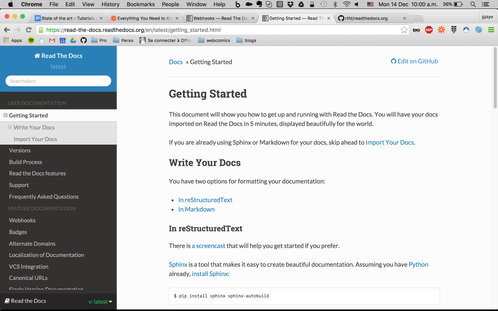
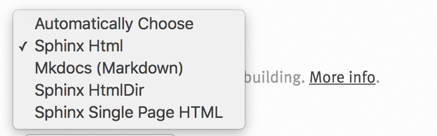
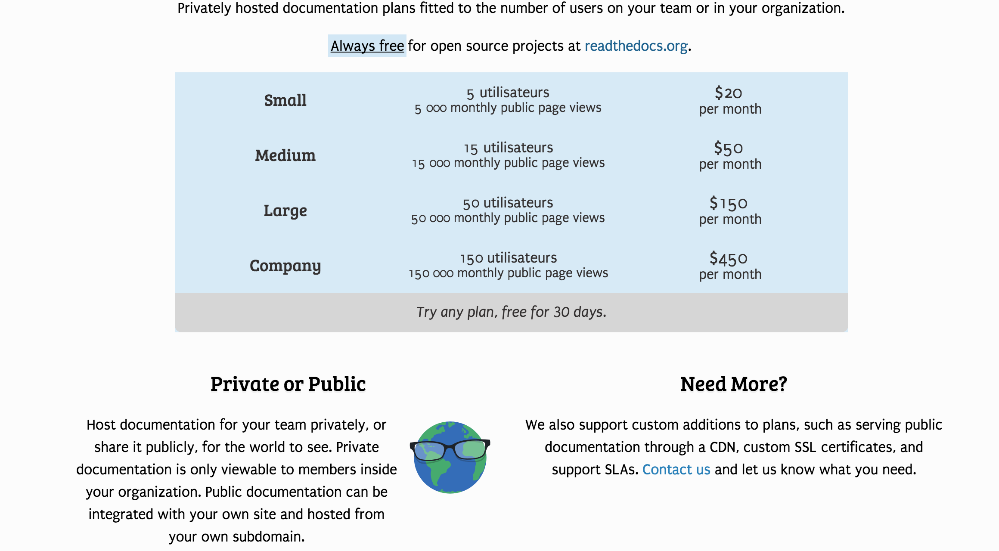
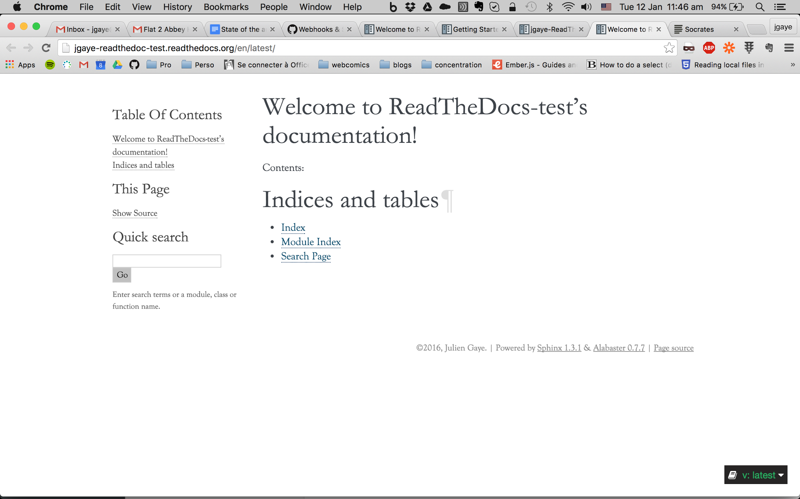

State of the art - Tutorials and documentation repository building tools

[[TOC]]

# Introduction

Why: To select a documentation repository for the App Composer. Know how to make documentation. Have some techno examples to make App Composer tutorial interactive.

What:

1. List of documentation tools with links and screenshots.

2. List of tutorials tools with links and screenshots

3. Bibliography of articles about how to make a documentation/tutos

Conclusion selects 1 or 2 documentation repos. Next steps.

No recommendations about tuto a priori.

# Documentation repository

Documentation tool must help with easy update of the doc repository

## Madcap software

madcap software

check the analyzer

## Read the Docs

tl;dr: Good tool if devs are writing the documentation, that can be made private if we pay.

[https://readthedocs.org/](https://readthedocs.org/)

Host your documentation and builds a doc repo automatically.

Must be written in reStructured text or Markdown

Auto update with webhooks, on github

It is free

Open source, it may break but can be debugged by us

Would be pointio.readthedocs.org

a priori it needs to be hosted on their site

Would be easy to trial

It looks like this:

ReadTheDoc has permissions to your github account

Documentation must be written in one of those languages:

Can we use something that is not text? some images type are supported.

Can run a local version of their server if we want.

[http://socrates.io/](http://socrates.io/): viewer for rst synthax

There is a version for businesses:

[https://readthedocs.com/](https://readthedocs.com/)

My test:

Configuration of the initial github project and readthedocs project:

1. Attach github repo to readthedoc - easy

2. Create the folders archi in the github project - ok for a dev with the tuto

3. Add created files to revision in git and push - easy for a dev

4. Configure the ReadTheDocs service in github - mild, you need to know about it

This 4 steps are enough to get this result for the documentation:

Configuration for a writer to be able to write:

1. Clone the github project - easy for a dev

2. Install the commands for sphynx (required?) - easy for a dev

Writing process

1. Checkout a github branch - easy for a dev

2. Write rst/markdown files - need to learn the language, but that’s quite easy for text

3. Edit index.rst to point to new doc files - need to learn language

4. Build the project to see the result - ok for a dev

5. Commit and push changes - easy for a dev

To learn rst (reStructuredText):

[http://www.sphinx-doc.org/en/stable/rest.html](http://www.sphinx-doc.org/en/stable/rest.html)

[http://socrates.io/](http://socrates.io/) <- this could make writing doable by non dev

Conversion to markdown from GDocs:

[http://lifehacker.com/this-script-converts-google-documents-to-markdown-for-e-511746113](http://lifehacker.com/this-script-converts-google-documents-to-markdown-for-e-511746113)

## Swiftype

[https://swiftype.com/](https://swiftype.com/)

Could be used for searching the documentation repository if the tool found doesn’t have this functionality.

[http://sphinx-doc.org/](http://sphinx-doc.org/)

[http://www.mindtouch.com/](http://www.mindtouch.com/) 

[http://www.sdl.com/cxc/knowledge-delivery/documentation-management-dita/](http://www.sdl.com/cxc/knowledge-delivery/documentation-management-dita/)

[https://www.atlassian.com/documentation-technical-writing-software/overview/](https://www.atlassian.com/documentation-technical-writing-software/overview/) 

[https://www.mediawiki.org/wiki/MediaWiki](https://www.mediawiki.org/wiki/MediaWiki) 

[https://www.dokuwiki.org/wiki:dokuwikihttps://www.dokuwiki.org/wiki:dokuwiki](https://www.dokuwiki.org/wiki:dokuwikihttps://www.dokuwiki.org/wiki:dokuwiki) 

[http://www.quark.com/en/Solutions/Enterprise_Solutions.aspx](http://www.quark.com/en/Solutions/Enterprise_Solutions.aspx) 

## Confluence

[https://www.k15t.com/blog/2014/05/seven-reasons-to-use-confluence-for-technical-documentation](https://www.k15t.com/blog/2014/05/seven-reasons-to-use-confluence-for-technical-documentation)

Internal wiki. Need a user account to be able to access. I’m sure you can tinker it to have visitors, but that’s not a user documentation repo.

so NO

# Tutorials tools

## Plunker

[http://plnkr.co/edit/6W9URNyyp2ItO4aUWzBB?p=preview](http://plnkr.co/edit/6W9URNyyp2ItO4aUWzBB?p=preview)

Here are a few options:

* [Website tour](http://tympanus.net/codrops/2010/12/21/website-tour/) - [Demo](http://tympanus.net/Development/WebsiteTour/)

* [jQuery Tour](http://codecanyon.net/item/jquery-tour-the-flexible-tour-plugin/1052564) - [Demo](http://revaxarts-themes.com/?t=tour)

* [Guiders](https://github.com/jeff-optimizely/Guiders-JS) - [Demo](http://jeffpickhardt.com/guiders/)

* [Bootstrap Tour](http://bootstraptour.com/) - [Demo](http://bootstraptour.com/)

* [Joyride](http://www.zurb.com/playground/jquery-joyride-feature-tour-plugin)

* [WalkMe](http://www.walkme.com/)

* [Tutorialize Me](http://tutorialize.me/)

* [Crumble](http://tommoor.github.com/crumble/)

* [Intro.js](https://github.com/usablica/intro.js)

* [myTips.co](http://mytips.co/)

* [Helppier.com](http://www.helppier.com/)

# Conclusion

Next steps:

	A way to get user tickets, concerning the doc or the Composer, in order to update the doc for users pain points => called knowledge management system / help center

# Bibliography

<table>
  <tr>
    <td>Link</td>
    <td>Check on</td>
  </tr>
  <tr>
    <td>https://zapier.com/blog/build-knowledge-base-documentation/</td>
    <td>12/14/2015</td>
  </tr>
  <tr>
    <td>https://jacobian.org/writing/great-documentation/</td>
    <td>12/14/2015</td>
  </tr>
  <tr>
    <td>http://docs.writethedocs.org/</td>
    <td>12/14/2015</td>
  </tr>
  <tr>
    <td>https://support.mozilla.org/en-US/kb/how-to-write-knowledge-base-articles</td>
    <td>12/14/2015</td>
  </tr>
  <tr>
    <td>http://blog.freshdesk.com/writing-a-knowledge-base-article/</td>
    <td>12/14/2015</td>
  </tr>
</table>

